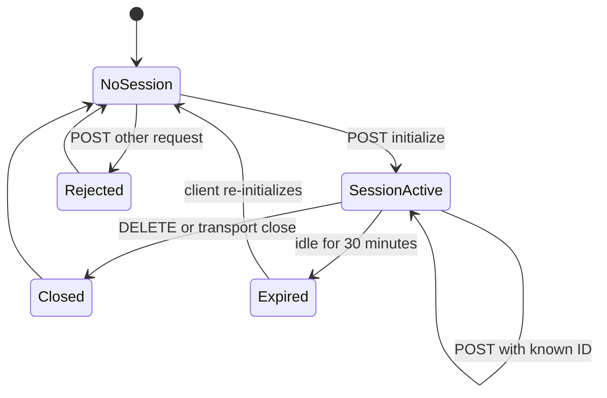

# MCP transport and sessions

`src/server.js` exposes public `GET /health` and the authenticated MCP surface at `POST`, `GET`, and `DELETE /mcp`. `MCP_AUTH_TOKEN` is captured at startup. If empty, `authGuard` deliberately permits requests for development; otherwise the exact `Authorization: Bearer ...` value is required and failures return 401.

CORS permits `GET, POST, DELETE, OPTIONS`, accepts `Content-Type, Authorization, Mcp-Session-Id`, and exposes `Mcp-Session-Id`.

Caption: session lifecycle implemented by the process-local `sessions` map.

## Request branches

- `POST /mcp` without an ID accepts only an initialize request, including a batch containing one. It creates a UUID-backed transport and MCP server. A non-initialize request returns HTTP 400 and JSON-RPC `-32600`.
- A known ID forwards the body and refreshes `lastUsed`.
- An unknown ID returns HTTP 404 and JSON-RPC `-32000`, instructing the client to initialize again.
- `GET /mcp` requires a known ID for the SSE stream; otherwise it returns HTTP 400 and `-32000`.
- `DELETE /mcp` closes and removes a known transport and returns `{success:true}`. Missing or unknown IDs return HTTP 400 and `-32000`.

If transport handling throws before Express sends headers, the outer catch returns HTTP 500 with JSON-RPC `-32603`; after headers are sent it logs the error but cannot safely replace the response. `transport.onclose` removes the session and closes the MCP server. A five-minute interval removes sessions idle at least 30 minutes and closes transports. State is process-local, so restart loses sessions; the interval has no explicit shutdown path. The listener binds `0.0.0.0`.

## MCP surface

`createMCPServer()` advertises `toolSchemas` in `tools/list` and dispatches `tools/call`; unknown names return an MCP error envelope with code 404, while thrown handlers become code 500. See [tool surface](../tools/overview.md).

Focused validation should use fresh processes for protected/open auth, direct and batch initialize without an ID, non-initialize POST without an ID (400), known-session POST with `lastUsed` refresh, unknown ID (404), GET missing/unknown ID (400), DELETE missing/unknown ID (400), successful DELETE, stale cleanup, and failures before versus after headers are sent. Static checks are `node --check src/server.js`, `curl /health`, and MCP initialize/list. There are no protocol tests in the repository.
