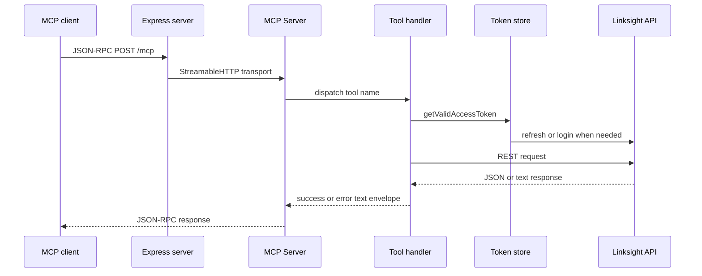

# System architecture

`src/server.js` is the composition root. It creates Express middleware, the MCP `Server`, `StreamableHTTPServerTransport` instances, the session map, and the listener. `app.cjs` exists only to let Phusion Passenger load the ESM server through dynamic `import()`.

The process has three boundaries: MCP clients call `/mcp`; `server.js` dispatches tool names through `toolSchemas` and `toolHandlers`; handlers call the external Linksight API through `createClient()` and its bearer-token provider in `auth.js`. The external backend owns persistence, authorization, and response schemas.

Caption: an MCP tool call crosses the transport, handler registry, authentication, and external API boundaries.

## Change navigation

- Transport or session behavior: [MCP transport](mcp-transport.md).
- Token and REST behavior: [Authentication and API client](../authentication/client.md).
- Tool registration: [Tool surface](../tools/overview.md).
- Deployment: [Operations](../operations/deployment.md).

Focused validation is `node --check src/server.js`, followed by a health request and MCP initialize/list call. No automated tests are present.
