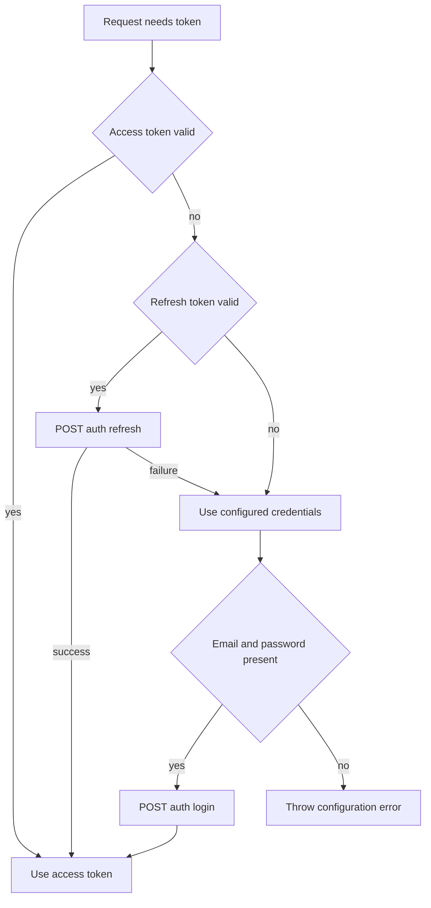

# Authentication and API client

`src/auth.js` owns one mutable process-global token object. `getValidAccessToken()` returns a valid access token, refreshes with `POST /auth/refresh`, or logs in with `LINKSIGHT_EMAIL` and `LINKSIGHT_PASSWORD`. `src/api-client.js:createClient()` calls this provider before every request.

JWT payloads are decoded with `Buffer`; absent or malformed tokens are expired, and valid tokens receive a 30-second safety margin. `setTokens(data)` shallow-merges returned fields into the existing `{access_token,refresh_token,user}` object; `clearTokens()` resets all three to null. Refresh failures silently fall through to credential login. Missing credentials throw before login. Non-OK login parses `{error}` when possible and throws; failed login leaves the prior token object unchanged because storage occurs only after success. Explicit `linksight_login` has the same preserve-on-failure behavior. There is no lock or request deduplication, so concurrent calls can race refresh/login and overwrite the shared account state.

The client resolves `LINKSIGHT_API_URL` or `http://localhost:3001/api`; `new URL(path, baseUrl.endsWith('/') ? baseUrl : baseUrl + '/')` makes relative paths stable whether the configured base has a trailing slash. It omits null/undefined query values, stringifies remaining values, adds bearer and JSON content headers as needed, and sends no body for GET/DELETE or when `body` is falsy. Bodies are `JSON.stringify`-serialized. Responses are read as text and JSON-parsed when possible, otherwise retained as text. Non-2xx errors use `message`, then `error`, then JSON text, and carry `status` and parsed/raw `data`. Tool handlers use `ok(data, meta)` to return `{content:[{type:'text',text: JSON.stringify({success:true,data,meta},null,2)}]}` and `fail(code,message,hint)` to return the same text content with `{success:false,error:{code,message}}` plus optional hint and `isError:true`; client failures use `e.status || 500`. The server catches anything escaping a handler as MCP text `isError:true` code 500, while unknown names use code 404.

Caption: fallback order in `getValidAccessToken()`.

## Operational boundary

`linksight_login` can replace the shared account explicitly; `clearTokens()` resets it. Tokens and user data never persist to disk. The backend defines token claims, refresh response shape, and authorization. Use a stub HTTP server to validate valid, expired, malformed, refresh-failure, login-failure, and non-JSON responses; no automated tests exist.
