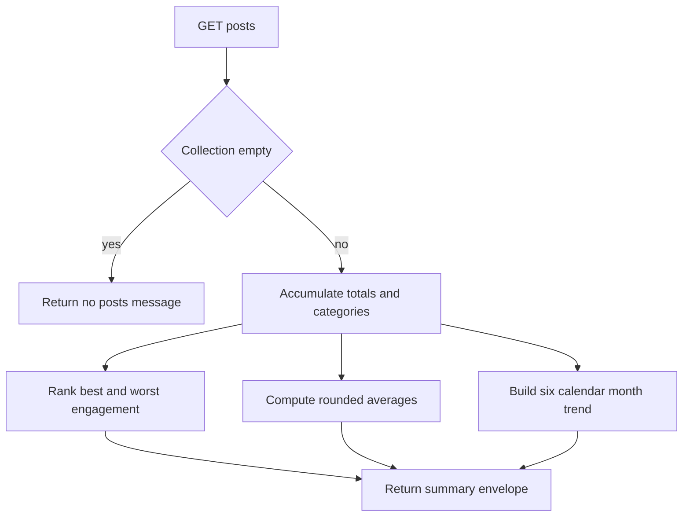

# Analytics summary

`linksight_analytics_summary` first GETs the full `posts` collection, then computes locally. An empty collection returns `{message:'No posts found'}` with count zero. Otherwise it returns `total`, `averages`, `best_post`, `worst_post`, `by_category`, and `monthly_trend`.

Metrics default to zero. Categories default to the literal `Sin categoría`. Global averages round views to integers and other averages to one decimal. Engagement rate is `(likes + comments + shares) / views * 100`, rounded to two decimals, or zero when views are zero. Best and worst rank by engagement and retain first-seen ties; each projection includes URL, first 100 text characters, engagement, views, and date. Category values include totals plus rounded average views and engagement.

The trend contains six calendar months from five months ago through the current month, using JavaScript `Date` parsing and local calendar month/year comparisons. Missing metrics remain safe; malformed dates remain in totals/rankings but match no trend month.

Caption: local stages after the single upstream posts request.

Use a stub dataset covering empty input, ties, missing metrics, long text, zero views, categories, and month boundaries. No unit fixture exists.
